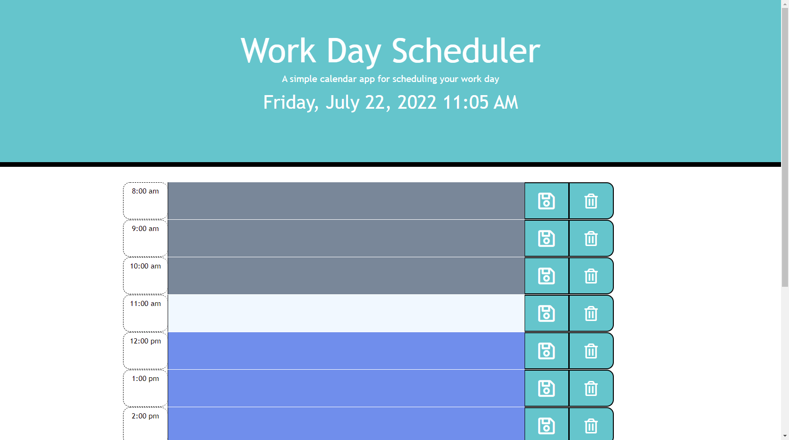

# Work Day Scheduler

## Description 

A simple calendar application that allows a user to save events for each hour of the day by modifying starter code. This app runs in the browser and features dynamically updated HTML, CSS, and Javascript including Moment.js

## URLs

* Deployed Application: 
    - [https://dylan-truong.github.io/05-Work-Day-Scheduler/](https://dylan-truong.github.io/05-Work-Day-Scheduler/)

* GitHub Repository:
    - [https://github.com/Dylan-Truong/05-Work-Day-Scheduler](https://github.com/Dylan-Truong/05-Work-Day-Scheduler)

## Screenshot

